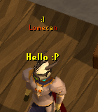
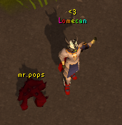
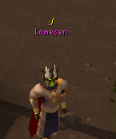

# RuneSocial 🎮

A social plugin for Old School RuneScape that lets you express yourself and see other players' personalities in real time.

Un plugin social para Old School RuneScape que te permite expresarte y ver la personalidad de otros jugadores en tiempo real.

---

# ✨ Features / Funciones

## 😄 Emoticons

Show an emoticon above your name that other RuneSocial players can see.

Muestra una carita encima de tu nombre que otros jugadores con RuneSocial pueden ver.

:) :( :'( >:( :O ;) B) x) :* :/ <3 xD uwu :P :$ =) *.* -.- -*- >.> >.< :v .*. zzZ o.O o.o :S ~_~

# Screenshots

### Player name effects

### Pet names

### Player mood

---

## 🎨 Color Effects

Animate your name with one of many color effects.

Anima tu nombre con uno de estos efectos de color.

| Effect          | Description                           |
| --------------- | ------------------------------------- |
| Rainbow         | Classic rainbow cycling colors        |
| Fire            | Red → orange → yellow flames          |
| Ice             | Cool blue shifting tones              |
| Pulse           | Your name color fades in and out      |
| Disco           | Each letter flashes a different color |
| Neon            | Bright neon glow cycling              |
| Lava            | Deep reds and oranges pulsing         |
| Galaxy          | Deep purples, blues and whites        |
| Toxic           | Pulsing neon green                    |
| Blood           | Dark to bright red pulse              |
| Matrix          | Green matrix-style glow               |
| Gradient BW     | Gray to white left to right           |
| Gradient Vert   | White top, gray bottom per letter     |
| Gradient Pink   | Hot pink gradient per letter          |
| Gradient Purple | Purple gradient per letter            |
| Gradient Blue   | Blue gradient per letter              |
| Gradient Red    | Red gradient per letter               |
| Gradient Green  | Green gradient per letter             |
| Gradient Yellow | Yellow gradient per letter            |
| Gradient Dark   | Dark to gray gradient per letter      |

---

## 🌊 Movement Effects

Make your name move.

Haz que tu nombre se mueva.

| Effect      | Description                            |
| ----------- | -------------------------------------- |
| Wave        | Each letter moves in a wave            |
| Upside Down | Your name bobs up and down             |
| Bounce      | Each letter bounces independently      |
| Float       | Smooth slow floating motion            |
| Shake       | Your name trembles rapidly             |
| Decode      | Letters scramble then reveal your name |

---

## 🐾 Pet Names

Assign a custom nickname and color to your pet. Other RuneSocial players will see it too.

Asigna un apodo y color personalizado a tu mascota. Otros jugadores con RuneSocial también lo verán.

Type `::petname` in game chat to name your pet.

Escribe `::petname` en el chat del juego para nombrar tu mascota.

---

# 🌐 How it works / Cómo funciona

RuneSocial uses a cloud backend to synchronize player profiles between nearby players in real time.

When you log in, your profile is registered automatically. Any changes you make in the configuration panel are synced with the server and visible to other RuneSocial players nearby.

RuneSocial usa un backend en la nube para sincronizar perfiles de jugadores cercanos en tiempo real.
Cuando inicias sesión, tu perfil se registra automáticamente. Cualquier cambio que hagas en el panel de configuración se sincroniza con el servidor y es visible para otros jugadores cercanos con RuneSocial.

---

# 🔒 Privacy

RuneSocial uses an external API to synchronize social features between players.

The plugin sends the following data:

* RuneScape username
* custom player display name
* mood / emoji selection
* pet name and color

No login credentials, account information, or personal data are collected.

---

# 📦 Installation

Once approved in the RuneLite Plugin Hub, RuneSocial can be installed directly from the in-game plugin list.

For development:

1. Download the latest `.jar` from Releases
2. Place it in your RuneLite plugins folder
3. Launch RuneLite with `--developer-mode`
4. Enable RuneSocial in the plugin list

---

# 👤 Author

Lomecan — GitHub

---

# 📄 License

This project is licensed under the BSD 2-Clause License.
